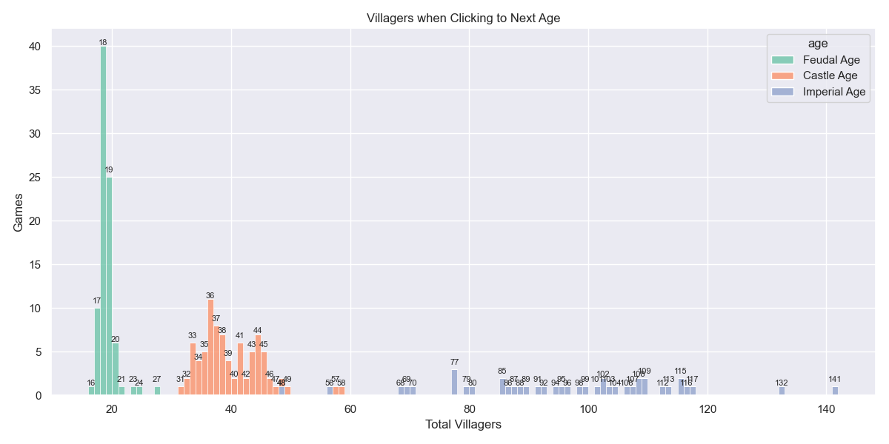
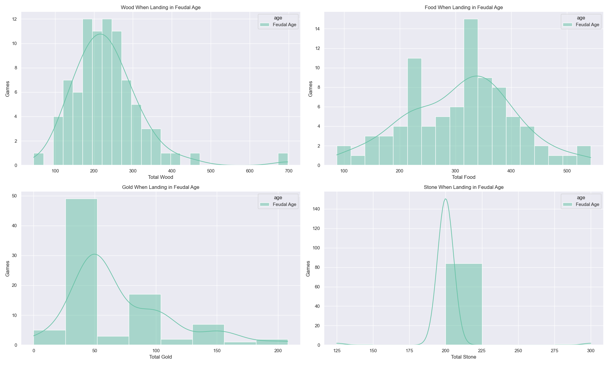

## what

1. download hera gameplay videos (1v1 AoE2 DE) from his second channel
2. binary search for frames of interest
   -  (e.g., first click up to each age, first frame of each age, final frame of game)
3. do OCR to extract data at this frame
4. visualize statistics of interest

tl;dr got blocked by youtube from downloading more. using recorded game files would be perfect except need game to run them (they're just a sequence of actions) and scripting aoe2 seems hard, capture age does it but there's no public info i could find, except a dev on reddit saying "it's hard"

## prelim results

## data collection on hold indefinitely

Well, ~25 data points isn't awful, but it's not great :-/

> yt_dlp.utils.DownloadError: ERROR: [youtube] dPdMgAr1-lw: Sign in to confirm you’re not a bot. Use --cookies-from-browser or --cookies for the authentication. See https://github.com/yt-dlp/yt-dlp/wiki/FAQ#how-do-i-pass-cookies-to-yt-dlp for how to manually pass cookies. Also see https://github.com/yt-dlp/yt-dlp/wiki/Extractors#exporting-youtube-cookies for tips on effectively exporting YouTube cookie

Things look complicated (getting & passing per-video tokens using multiple plugins), and then still questionable (may not fix it), and risk getting IP banned.

## postmortem

good weekend project

new tech

-  uv
-  wsl
-  gemini (+ img)
-  pytesseract, easyocr (abandoned)
-  yt-dlp

ended b/c

-  yt-dlp — youtube blocking (cat+mouse seemed complicated; rotate IPs and/or get token→ cookies)
-  not enough data to see larger trends (24 videos only)
-  non-blocking, but: cv2 hard failed on WSL, py-av (ffmpeg wrapper) workarounds so slow / broken, would maybe have had to recompile cv2 from source. meant i was running on laptop and not box, which was lame. WSL setup otherwise pretty great.

i don’t overly regret getting all OCR-able data from every frame of interest (score, maybe civ, date, etc.) , but at only 24 videos, my analysis was inherently limited. looking at captureage by-frame stats gives way more interesting stuff for low n.

since ranked games are automatically recorded and available for download, being able to script the game and read data would be a way to get way more data, with no youtube limits, and without OCR. but it seems very hard, and captureage (which does this) offers no guidance.
